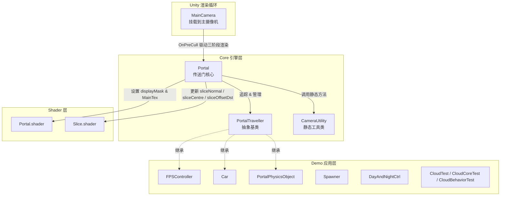
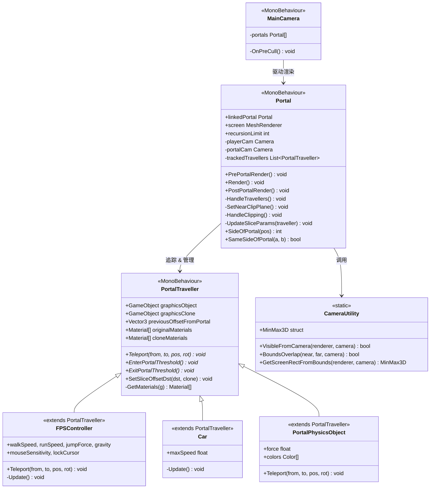
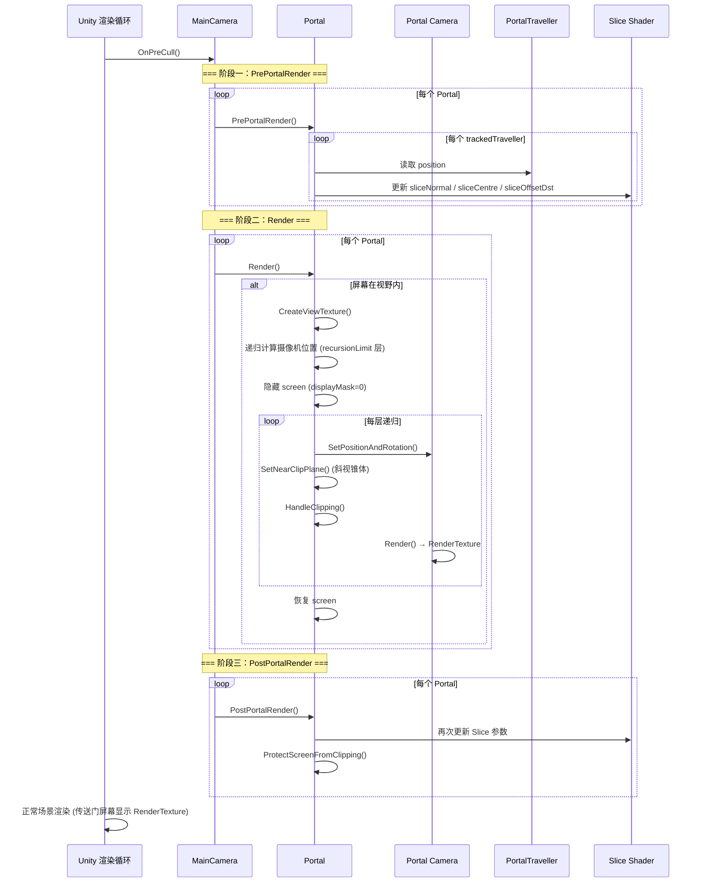
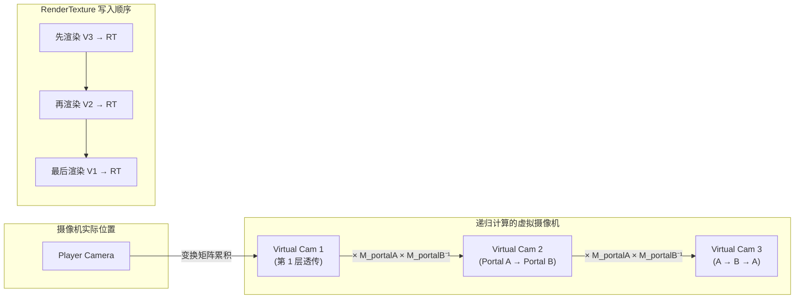

# Portals in Unity — 项目技术报告

> 基于 Sebastian Lague 开源项目的源码分析与架构解读

---

## 目录

1. [项目概述](#1-项目概述)
2. [项目结构总览](#2-项目结构总览)
3. [系统架构](#3-系统架构)
4. [Core 层详解](#4-core-层详解)
5. [Shader 详解](#5-shader-详解)
6. [渲染管线](#6-渲染管线)
7. [Demo 层简介](#7-demo-层简介)
8. [场景说明](#8-场景说明)

---

## 1. 项目概述

本项目是一个 Unity 传送门（Portal）机制的技术演示，实现了类似游戏《Portal》中传送门的核心效果：玩家和物理对象可以穿越传送门，传送门表面实时渲染另一侧的画面（包括递归传送门互相可见的情况）。

**技术栈**：Unity（C#）、HLSL/Cg Shader、内置渲染管线

**核心能力**：
- 物体穿越传送门时无缝传送，保持物理动量（线速度 + 角速度）
- 传送门表面实时渲染对面场景（RenderTexture 方案）
- 支持递归渲染（传送门中看到传送门中看到传送门……）
- Slice Shader 实现穿越传送门物体的半身裁剪
- 斜视锥体裁剪（Oblique Near Clip Plane）优化渲染精度

**源码文件**：[Assets/Scripts/](Assets/Scripts/)

---

## 2. 项目结构总览

```
Assets/
├── Scripts/
│   ├── Core/                          # 核心引擎（4 个 C# + 2 个 Shader）
│   │   ├── Portal.cs                  # 传送门核心逻辑
│   │   ├── PortalTraveller.cs         # 可穿越传送门的对象基类
│   │   ├── MainCamera.cs              # 主摄像机，驱动渲染管线
│   │   ├── CameraUtility.cs           # 摄像机工具类（视锥检测等）
│   │   └── Shaders/
│   │       ├── Portal.shader          # 传送门屏幕着色器
│   │       └── Slice.shader           # 物体裁剪着色器
│   └── Demo/                          # 示例玩法（8 个 C# + 2 个 Shader）
│       ├── FPSController.cs           # 第一人称控制器
│       ├── Car.cs                     # 汽车控制器
│       ├── PortalPhysicsObject.cs     # 物理传送对象
│       ├── Spawner.cs                 # 物体生成器
│       ├── DayAndNightCtrl.cs         # 昼夜循环
│       ├── CloudTest.cs               # 云系统初始化
│       ├── CloudCoreTest.cs           # 云核心旋转
│       ├── CloudBehaviorTest.cs       # 云块行为
│       └── Shaders/
│           ├── CloudTest.shader
│           └── SkyDome.shader
├── Scenes/
│   ├── Physics.unity                  # 物理传送演示
│   ├── Recursion.unity                # 递归渲染演示
│   ├── Slicing.unity                  # 裁剪效果演示
│   └── Two Worlds.unity              # 跨世界连接演示
├── Prefabs/                           # 7 个预制体
├── Materials/                         # 39 个材质
└── Models/                            # 3D 模型（FBX + Blender）
```

---

## 3. 系统架构

### 3.1 整体架构图



### 3.2 类图



---

## 4. Core 层详解

Core 层是传送门系统的引擎，共 4 个 C# 脚本和 2 个 Shader。

### 4.1 Portal.cs — 传送门核心

**文件路径**：[Assets/Scripts/Core/Portal.cs](Assets/Scripts/Core/Portal.cs)

这是整个项目最核心的脚本（~320 行），挂载在每个传送门 GameObject 上。每个 Portal 通过 `linkedPortal` 字段引用配对的另一个传送门。

#### 关键字段

| 字段 | 类型 | 说明 |
|------|------|------|
| `linkedPortal` | `Portal` | 配对的另一扇传送门 |
| `screen` | `MeshRenderer` | 传送门的显示平面（渲染对面画面） |
| `recursionLimit` | `int` | 递归渲染最大深度（默认 5） |
| `nearClipOffset` | `float` | 近裁剪面偏移量（默认 0.05） |
| `nearClipLimit` | `float` | 距离传送门多近时停用斜视锥体（默认 0.2） |

#### 核心方法

**生命周期**

| 方法 | 调用时机 | 职责 |
|------|---------|------|
| `Awake()` | 初始化 | 获取主摄像机、Portal 子摄像机、screen 的 MeshFilter，设置 displayMask=1 |
| `LateUpdate()` | 每帧 | 调用 `HandleTravellers()` 检测物体穿越 |

**三阶段渲染管线**（由 MainCamera.OnPreCull 驱动）

| 方法 | 阶段 | 职责 |
|------|------|------|
| `PrePortalRender()` | 第一阶段 | 为所有被追踪的 Traveller 更新 Slice Shader 参数 |
| `Render()` | 第二阶段 | 核心渲染：创建 RenderTexture → 递归计算摄像机位置 → 逐层渲染 |
| `PostPortalRender()` | 第三阶段 | 再次更新 Slice 参数，调用 `ProtectScreenFromClipping` 防止近裁剪面穿模 |

**穿越检测与传送**

| 方法 | 职责 |
|------|------|
| `HandleTravellers()` | 逐帧检测每个 Traveller 是否穿越传送门平面（比较前后帧偏移向量与 forward 的点积符号），若穿越则执行传送 |
| `OnTriggerEnter(Collider)` | 检测到 Traveller 进入触发器范围，调用 `OnTravellerEnterPortal` |
| `OnTriggerExit(Collider)` | Traveller 离开触发器范围，调用 `ExitPortalThreshold` 清理 clone |
| `OnTravellerEnterPortal(PortalTraveller)` | 初始化 Traveller 追踪：创建 graphicsClone、记录初始偏移量 |

**辅助方法**

| 方法 | 职责 |
|------|------|
| `SetNearClipPlane()` | 计算斜视锥体裁剪矩阵（Oblique Near Clip Plane），使近裁剪面与传送门表面重合 |
| `HandleClipping()` | 解决两个视觉瑕疵：传送门背面微小残留面（issue 1）和裁剪与非裁剪间的接缝（issue 2） |
| `UpdateSliceParams(PortalTraveller)` | 根据玩家和 Traveller 的相对位置计算并设置 Slice Shader 的 sliceNormal/sliceCentre/sliceOffsetDst |
| `CreateViewTexture()` | 按屏幕分辨率创建 RenderTexture，绑定到 Portal Camera 和 linkedPortal.screen.material |
| `ProtectScreenFromClipping(Vector3)` | 动态调整 screen 的厚度和位置，防止摄像机近裁剪面穿过 portal 屏幕 |
| `SideOfPortal(Vector3)` | 返回 +1 或 -1，判断世界坐标在传送门的哪一侧 |

#### 穿越检测算法

```csharp
// 核心逻辑（简化）
Vector3 offsetFromPortal = traveller.position - transform.position;
int portalSide = Sign(Dot(offsetFromPortal, transform.forward));
int portalSideOld = Sign(Dot(traveller.previousOffsetFromPortal, transform.forward));

if (portalSide != portalSideOld) {
    // 发生了穿越！
    traveller.Teleport(fromPortal, toPortal, newPos, newRot);
}
```

通过比较当前帧和上一帧的偏移向量与传送门 forward 的点积符号，判断物体是否跨越了传送门平面。

#### 递归渲染算法

```csharp
// 逐层计算虚拟摄像机位置
for (int i = 0; i < recursionLimit; i++) {
    if (i > 0 && !BoundsOverlap(screen, linkedPortal.screen, portalCam))
        break; // 不再可见，停止递归
    
    localToWorldMatrix = transform.localToWorldMatrix 
                       * linkedPortal.transform.worldToLocalMatrix 
                       * localToWorldMatrix;
    // 记录该深度对应的摄像机位置和旋转
}
// 从最深层次开始反向渲染
for (int i = startIndex; i < recursionLimit; i++) {
    portalCam.Render();
}
```

每层将摄像机矩阵依次通过传送门对变换，模拟光线在传送门间反弹的路径。从最深处反向渲染确保内层画面先被绘制到 RenderTexture，外层再叠加。

---

### 4.2 PortalTraveller.cs — 可传送对象基类

**文件路径**：[Assets/Scripts/Core/PortalTraveller.cs](Assets/Scripts/Core/PortalTraveller.cs)

所有可以穿越传送门的对象都继承此类（~60 行）。

#### 关键属性

| 属性 | 类型 | 说明 |
|------|------|------|
| `graphicsObject` | `GameObject` | 实际的图形对象（由子类赋值） |
| `graphicsClone` | `GameObject` | 在传送门另一侧显示的视觉克隆体 |
| `previousOffsetFromPortal` | `Vector3` | 上一帧相对于传送门的位置偏移（用于穿越检测） |
| `originalMaterials` | `Material[]` | 本体所有材质 |
| `cloneMaterials` | `Material[]` | 克隆体所有材质 |

#### 虚方法

| 方法 | 说明 |
|------|------|
| `Teleport(from, to, pos, rot)` | **虚方法**。默认只设置 position 和 rotation。子类覆写以处理额外的物理量 |
| `EnterPortalThreshold()` | 进入传送门范围时：Instantiate graphicsClone、收集 originalMaterials 和 cloneMaterials |
| `ExitPortalThreshold()` | 离开传送门范围时：隐藏 clone、重置所有材质的 sliceNormal 为 Vector3.zero（禁用裁剪） |

#### 具体方法

| 方法 | 说明 |
|------|------|
| `SetSliceOffsetDst(float, bool)` | 设置 clone=true 时更新 cloneMaterials 的 sliceOffsetDst，否则更新 originalMaterials |
| `GetMaterials(GameObject)` | 递归收集 GameObject 及其子对象上所有 MeshRenderer 的 Material 实例 |

`graphicsClone` 的作用：当玩家站在传送门一侧时，clone 出现在传送门另一侧作为视觉替身，配合 Slice Shader 实现"半身在门外"的视觉效果。

---

### 4.3 MainCamera.cs — 渲染管线驱动

**文件路径**：[Assets/Scripts/Core/MainCamera.cs](Assets/Scripts/Core/MainCamera.cs)

极其精简的脚本（~25 行），挂载在主摄像机上。

```csharp
void OnPreCull() {
    for (int i = 0; i < portals.Length; i++)
        portals[i].PrePortalRender();   // 阶段一

    for (int i = 0; i < portals.Length; i++)
        portals[i].Render();            // 阶段二

    for (int i = 0; i < portals.Length; i++)
        portals[i].PostPortalRender();  // 阶段三
}
```

`OnPreCull` 是 Unity 摄像机在剔除（Culling）之前触发的回调。在此阶段渲染所有传送门视图到 RenderTexture，之后主摄像机正常渲染场景时，传送门屏幕材质就能正确显示已渲染好的画面。

---

### 4.4 CameraUtility.cs — 摄像机工具类

**文件路径**：[Assets/Scripts/Core/CameraUtility.cs](Assets/Scripts/Core/CameraUtility.cs)

纯静态工具类（~100 行），提供摄像机空间计算。

#### 静态方法

| 方法 | 说明 |
|------|------|
| `VisibleFromCamera(Renderer, Camera)` | 使用 `GeometryUtility.TestPlanesAABB` 检测 Renderer 是否在摄像机视锥体内 |
| `BoundsOverlap(MeshFilter, MeshFilter, Camera)` | 判断两个 MeshFilter 在屏幕空间是否重叠（且 far 确实比 near 更远）。用于递归渲染时判断是否还需要继续递归 |
| `GetScreenRectFromBounds(MeshFilter, Camera)` | 将 Mesh 的 8 个包围盒角点变换到屏幕空间，计算屏幕空间包围矩形。正确处理了位于摄像机背后的角点（clamp 到屏幕边缘） |

#### 内部结构体 MinMax3D

```csharp
public struct MinMax3D {
    public float xMin, xMax, yMin, yMax, zMin, zMax;
    public void AddPoint(Vector3 point) { /* 扩展范围以包含新点 */ }
}
```

用于累积 3D 空间中一组点的包围盒，支持 `GetScreenRectFromBounds` 逐步扩大屏幕空间矩形。

---

## 5. Shader 详解

### 5.1 Portal.shader — 传送门屏幕

**文件路径**：[Assets/Scripts/Core/Shaders/Portal.shader](Assets/Scripts/Core/Shaders/Portal.shader)

极其简洁的单 Pass Shader（~55 行）：

```hlsl
fixed4 frag(v2f i) : SV_Target {
    float2 uv = i.screenPos.xy / i.screenPos.w;
    fixed4 portalCol = tex2D(_MainTex, uv);
    return portalCol * displayMask + _InactiveColour * (1 - displayMask);
}
```

- `displayMask`：由 Portal.cs 动态控制。渲染前设为 0（隐藏对面画面，避免摄像机看到自己），渲染后设为 1（正常显示）
- `_MainTex`：Portal.cs 通过 `CreateViewTexture()` 将 Portal Camera 的 RenderTexture 绑定到此纹理
- `_InactiveColour`：displayMask=0 时显示的兜底颜色

### 5.2 Slice.shader — 物体裁剪

**文件路径**：[Assets/Scripts/Core/Shaders/Slice.shader](Assets/Scripts/Core/Shaders/Slice.shader)

基于世界坐标的平面裁剪 Shader（~60 行）：

```hlsl
float3 sliceNormal;    // 裁剪平面法线（世界空间）
float3 sliceCentre;    // 裁剪平面中心（世界空间）
float sliceOffsetDst;  // 偏移距离（调节裁剪平面的前后位置）

void surf(Input IN, inout SurfaceOutputStandard o) {
    float3 adjustedCentre = sliceCentre + sliceNormal * sliceOffsetDst;
    float3 offsetToSliceCentre = adjustedCentre - IN.worldPos;
    clip(dot(offsetToSliceCentre, sliceNormal));  // 核心：点在平面另一侧则丢弃
    // ... 标准 PBR 着色
}
```

- `clip(x)`：当 x < 0 时丢弃该像素。通过 `dot(worldPos - centre, normal)` 判断像素在世界空间中位于裁剪平面的哪一侧
- `sliceOffsetDst`：沿法线方向微调裁剪平面位置，由 Portal.cs 的 `HandleClipping()` 动态调节以消除视觉瑕疵
- Portal.cs 的 `UpdateSliceParams()` 每帧更新这三个参数到所有相关材质上

---

## 6. 渲染管线

### 6.1 完整渲染流程



### 6.2 递归渲染原理



每层将摄像机矩阵依次通过传送门对的变换矩阵，模拟光线在两个传送门之间多次反弹的虚拟路径。渲染从最深层次开始（反向），因为要先渲染内层画面到 RenderTexture，外层才能正确采样到内层结果。

---

## 7. Demo 层简介

Demo 层是对 Core 引擎的示例应用，共 8 个脚本。

### 7.1 FPSController.cs

**文件路径**：[Assets/Scripts/Demo/FPSController.cs](Assets/Scripts/Demo/FPSController.cs)
**继承**：`PortalTraveller`

第一人称角色控制器。支持 WASD 移动、Shift 加速跑、Space 跳跃（含 0.15 秒 Coyote Time）、鼠标视角控制。

**覆写的 Teleport**：

```csharp
public override void Teleport(Transform fromPortal, Transform toPortal, Vector3 pos, Quaternion rot) {
    transform.position = pos;
    // 处理视角旋转
    float delta = Mathf.DeltaAngle(smoothYaw, rot.eulerAngles.y);
    yaw += delta;
    smoothYaw += delta;
    // 将速度从源传送门空间变换到目标传送门空间
    velocity = toPortal.TransformVector(fromPortal.InverseTransformVector(velocity));
    Physics.SyncTransforms();
}
```

### 7.2 PortalPhysicsObject.cs

**文件路径**：[Assets/Scripts/Demo/PortalPhysicsObject.cs](Assets/Scripts/Demo/PortalPhysicsObject.cs)
**继承**：`PortalTraveller`，依赖 `Rigidbody`

物理对象传送。每生成一个新实例自动循环分配颜色。

**覆写的 Teleport**：

```csharp
public override void Teleport(Transform fromPortal, Transform toPortal, Vector3 pos, Quaternion rot) {
    base.Teleport(fromPortal, toPortal, pos, rot);
    rigidbody.velocity = toPortal.TransformVector(fromPortal.InverseTransformVector(rigidbody.velocity));
    rigidbody.angularVelocity = toPortal.TransformVector(fromPortal.InverseTransformVector(rigidbody.angularVelocity));
}
```

同时变换线速度和角速度，保证物理对象穿越传送门后运动方向正确。

### 7.3 Car.cs

**文件路径**：[Assets/Scripts/Demo/Car.cs](Assets/Scripts/Demo/Car.cs)
**继承**：`PortalTraveller`

简单的自动驾驶汽车，按 C 键启停，沿 forward 方向匀速前进。使用默认 Teleport（只改 position/rotation）。

### 7.4 Spawner.cs

**文件路径**：[Assets/Scripts/Demo/Spawner.cs](Assets/Scripts/Demo/Spawner.cs)

按 Space 键在当前位置生成 prefab 实例。用于在 Physics 场景中不断生成物理方块。

### 7.5 DayAndNightCtrl.cs

**文件路径**：[Assets/Scripts/Demo/DayAndNightCtrl.cs](Assets/Scripts/Demo/DayAndNightCtrl.cs)

控制 Directional Light 绕 X 轴旋转，60 秒完成一个完整的昼夜循环。

### 7.6 Cloud 系统（3 个脚本）

| 文件 | 职责 |
|------|------|
| [CloudTest.cs](Assets/Scripts/Demo/CloudTest.cs) | 使用黄金比例（斐波那契球面分布）在球面上程序化生成云块和云核心 |
| [CloudCoreTest.cs](Assets/Scripts/Demo/CloudCoreTest.cs) | 云核心绕父节点旋转，定义 falloffDst 和 maxScale 影响周围的云块 |
| [CloudBehaviorTest.cs](Assets/Scripts/Demo/CloudBehaviorTest.cs) | 每个云块绕父节点旋转，并根据与所有 CloudCore 的距离动态缩放（距离越近越大） |

这三个脚本共同构成一个程序化体积云系统，用于 Two Worlds 场景的环境装饰。

---

## 8. 场景说明

| 场景 | 文件 | 演示内容 |
|------|------|---------|
| **Physics** | [Physics.unity](Assets/Scenes/Physics.unity) | 物理对象（方块）穿越传送门，展示线速度和角速度的变换守恒。使用 Spawner 生成方块，按 Space 投放 |
| **Recursion** | [Recursion.unity](Assets/Scenes/Recursion.unity) | 两扇传送门互相可见时的递归渲染效果。`recursionLimit` 控制最大递归深度 |
| **Slicing** | [Slicing.unity](Assets/Scenes/Slicing.unity) | Slice Shader 的裁剪效果演示。物体穿过传送门时一半可见一半不可见 |
| **Two Worlds** | [Two Worlds.unity](Assets/Scenes/Two Worlds.unity) | 两个完全不同环境的世界通过传送门连接。包含 Cloud 云系统、Car、FPS 控制器。需要安装 Blender 以查看部分模型 |

---

## 附录：关键代码文件索引

| 文件 | 行数 | 角色 |
|------|------|------|
| [Assets/Scripts/Core/Portal.cs](Assets/Scripts/Core/Portal.cs) | 320 | 传送门核心：穿越检测、递归渲染、Clip 管理 |
| [Assets/Scripts/Core/PortalTraveller.cs](Assets/Scripts/Core/PortalTraveller.cs) | 61 | 可传送对象基类：graphicsClone 生命周期 |
| [Assets/Scripts/Core/MainCamera.cs](Assets/Scripts/Core/MainCamera.cs) | 26 | 三阶段渲染管线驱动 |
| [Assets/Scripts/Core/CameraUtility.cs](Assets/Scripts/Core/CameraUtility.cs) | 103 | 视锥检测、屏幕空间包围盒 |
| [Assets/Scripts/Core/Shaders/Portal.shader](Assets/Scripts/Core/Shaders/Portal.shader) | 55 | 传送门屏幕着色器 |
| [Assets/Scripts/Core/Shaders/Slice.shader](Assets/Scripts/Core/Shaders/Slice.shader) | 63 | 世界空间平面裁剪着色器 |
| [Assets/Scripts/Demo/FPSController.cs](Assets/Scripts/Demo/FPSController.cs) | 127 | 第一人称控制器（含速度变换） |
| [Assets/Scripts/Demo/PortalPhysicsObject.cs](Assets/Scripts/Demo/PortalPhysicsObject.cs) | 27 | 物理对象（含线/角速度变换） |
| [Assets/Scripts/Demo/Car.cs](Assets/Scripts/Demo/Car.cs) | 25 | 自动驾驶汽车 |
| [Assets/Scripts/Demo/Spawner.cs](Assets/Scripts/Demo/Spawner.cs) | 26 | 物体生成器 |
| [Assets/Scripts/Demo/DayAndNightCtrl.cs](Assets/Scripts/Demo/DayAndNightCtrl.cs) | 23 | 昼夜循环控制 |
| [Assets/Scripts/Demo/CloudTest.cs](Assets/Scripts/Demo/CloudTest.cs) | 51 | 云系统初始化（斐波那契球面分布） |
| [Assets/Scripts/Demo/CloudCoreTest.cs](Assets/Scripts/Demo/CloudCoreTest.cs) | 26 | 云核心旋转 |
| [Assets/Scripts/Demo/CloudBehaviorTest.cs](Assets/Scripts/Demo/CloudBehaviorTest.cs) | 34 | 云块距离衰减缩放 |
